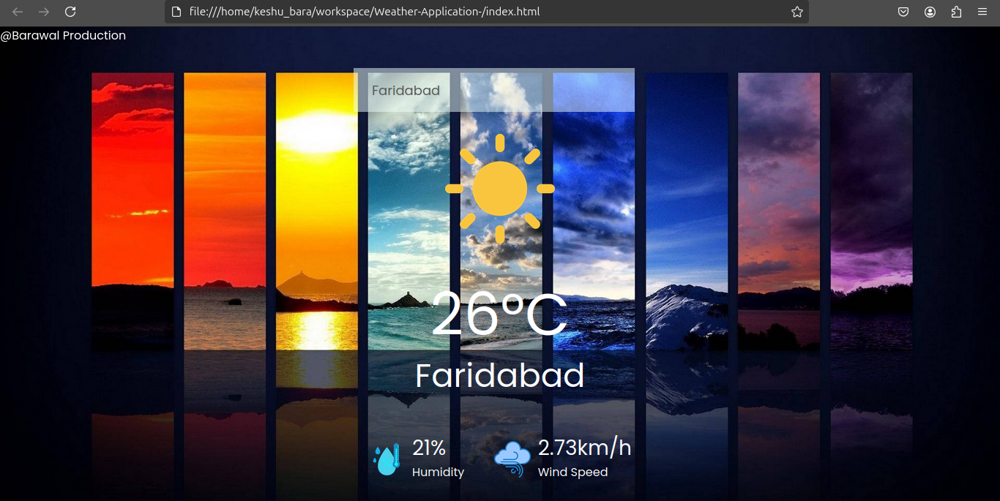
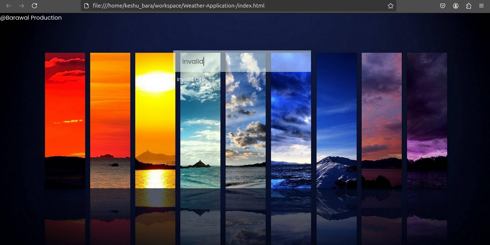
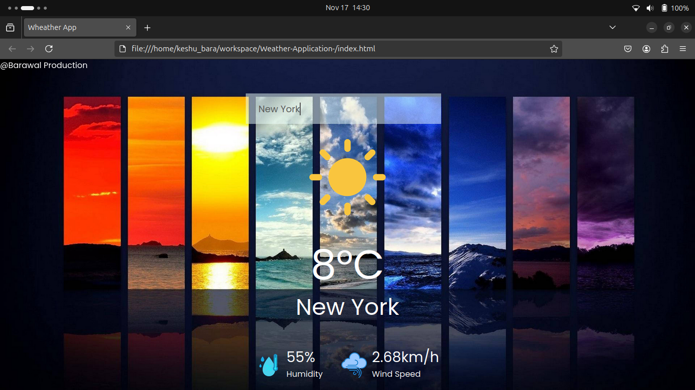

# Weather-Application-
A simple weather forecast app built with HTML, CSS, and Vanilla JavaScript. This application leverages the OpenWeather API to provide real-time weather updates for any location entered by the user.

